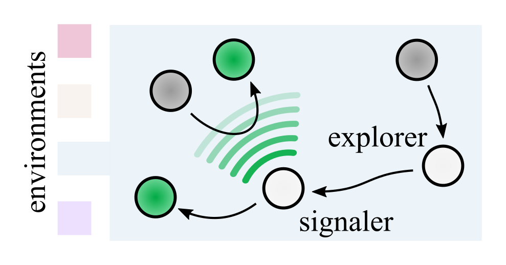
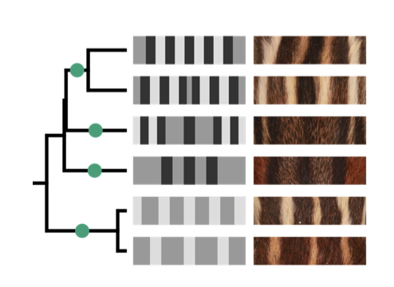
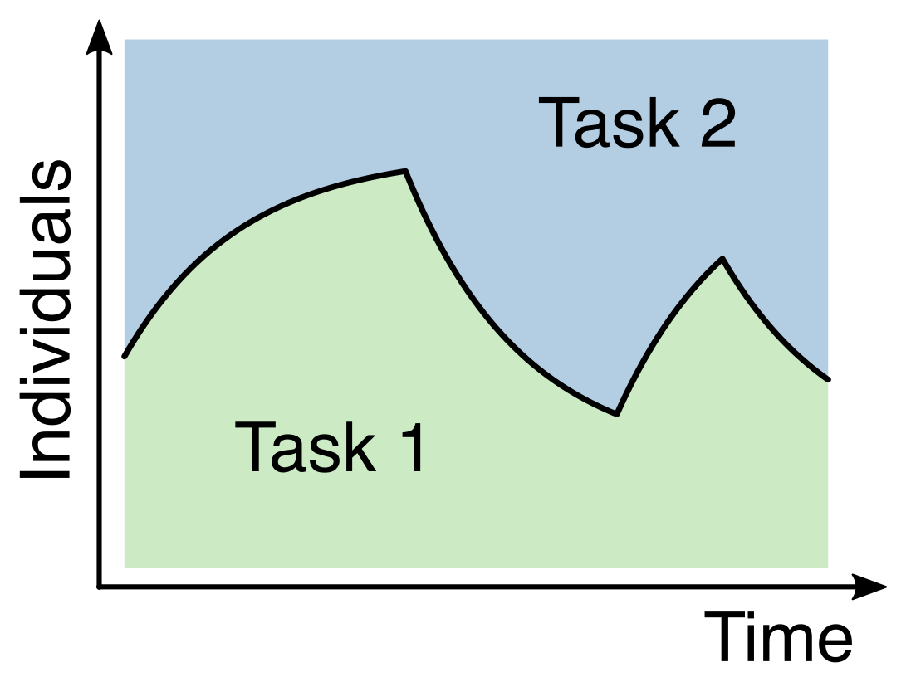
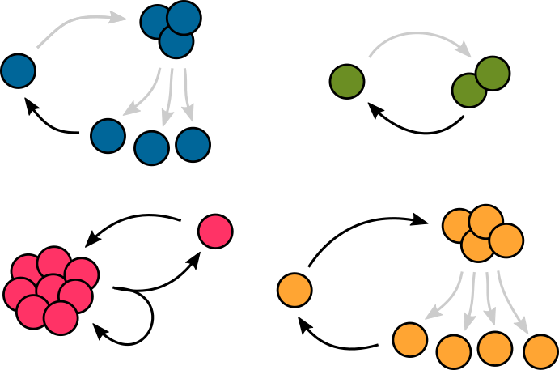
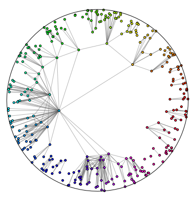


## List of publications



## Recent publications




 Please reach out to me with questions/comments about any of these papers or with requests for a copy. I'd love to hear from you! 
 


<table>
<tr>
<td style="vertical-align:middle; max-width:500px; min-width:70%">

 Ecological principles for the evolution of communication in collective systems 
 

 <U>Merlijn Staps</U>, Corina E. Tarnita, and Mari Kawakatsu 

 <I> Proceedings of the Royal Society B: Biological Sciences</I>, 291: 20241562 (2024) 

 <a href="https://royalsocietypublishing.org/doi/10.1098/rspb.2024.1562" target="_blank"> doi </a> 
&middot; <a href="https://royalsocietypublishing.org/doi/pdf/10.1098/rspb.2024.1562" target="_blank"> pdf </a> 

 We derive ecological conditions for the evolution of communication in a collective context and show how diverse communication strategies used by social insects (e.g., honeybee waggle dance, trail pheromones, antennal contacts) can be explained theoretically as adaptations to different ecological circumstances.  
 

</td>

<td style="vertical-align:middle; padding-left:10pt">

</td>
</tr>
</table>

<table>
<tr>
<td style="vertical-align:middle; max-width:500px; min-width:70%">

 Development shapes the evolutionary diversification of rodent stripe patterns 
 

 <U>Merlijn Staps</U>, Pearson W. Miller, Corina E. Tarnita, and Ricardo Mallarino 

 <I> Proceedings of the National Academy of Sciences USA </I> 120 (45), e2312077120 (2023) 

 <a href="https://www.pnas.org/doi/10.1073/pnas.2312077120" target="_blank"> doi </a> 
&middot; <a href="https://www.mallarinolab.org/uploads/9/0/6/5/90653467/stapsetalpnas2023.pdf" target="_blank"> pdf </a> 

In this work, we describe the diversity of rodent stripe patterns and explain it from simple developmental principles. We do so by using an integrated approach that combines recent molecular insights, pattern formation models, and phylogenetic analysis. 
 

</td>

<td style="vertical-align:middle; padding-left:10pt">

</td>
</tr>
</table>

 

<table>
<tr>
<td style="vertical-align:middle; max-width:550px; min-width:80%">

 When being flexible matters: ecological underpinnings for the evolution of collective flexibility and task allocation 
 

 <U>Merlijn Staps</U> & Corina E. Tarnita 

 <I> Proceedings of the National Academy of Sciences USA </I>  119 (18), e2116066119 (2022) 

 <a href="https://www.doi.org/10.1073/pnas.2116066119" target="_blank"> doi </a> 
&middot; <a href="https://www.pnas.org/doi/epdf/10.1073/pnas.2116066119" target="_blank"> pdf </a> 

 In this paper, we develop a general theoretical framework 
for the evolution of task allocation in variable environments, applicable to multicellular organisms and social insect colonies. 
We derive simple and general conditions for the evolution of collective flexibility, and propose potential theoretical explanations for some puzzling empirical observations.
 

 </td>

 <td style="vertical-align:middle; padding-left:10pt">
 
 </td>
 </tr>
 </table>



 Life cycles as a central organizing theme for studying multicellularity 
 

 <U>Merlijn Staps</U>, Jordi van Gestel, and Corina E. Tarnita 

 <I> The Evolution of Multicellularity</I>, edited by Matthew Herron, Peter Conlin, and Will Ratcliff (2022) 

 <a href="https://www.routledge.com/The-Evolution-of-Multicellularity/Herron-Conlin-Ratcliff/p/book/9780367356965" target="_blank"> link to book </a>  

 Contributed book chapter outlining life cycles as a conceptual tool to study the evolutionary origins of multicellularity. 





 How geometry shapes division of labor 
 

 <U>Merlijn Staps</U> & Corina E. Tarnita 

 <I> eLife </I> 9:e63328 (2020) 

 <a href="https://doi.org/10.7554/eLife.63328" target="_blank"> doi </a> 

"Insight" article accompanying <a href="https://elifesciences.org/articles/54348" target="_blank">article</a> by Yanni et al., <I>Topological constraints in early multicellularity favor reproductive division of labor.</I> 





<table>
<tr>
<td style="vertical-align:middle; max-width:500px; min-width:70%">

 Emergence of diverse life cycles and life histories at the origin of multicellularity 
 

 <U>Merlijn Staps</U>, Jordi van Gestel, and Corina E. Tarnita 

 <I> Nature Ecology & Evolution </I> 3, 1197-1205 (2019) 

 <a href="https://doi.org/10.1038/s41559-019-0940-0" target="_blank"> doi </a> &middot; <a href="https://www.nature.com/articles/s41559-019-0940-0.pdf" target="_blank"> pdf </a> &middot;
<a href="https://ecoevocommunity.nature.com/posts/50860-modeling-the-evolution-of-the-first-multicellular-life-cycles" target="_blank">behind-the-paper</a> 

 In this paper, we build a theoretical model for the first emergence of multicellular life cycles, starting from a unicellular ancestor. 
We find that diverse types of multicellular life cycles could have easily emerged early on, shaped by ancestral constraints and ecological conditions.  
 

</td>

<td style="vertical-align:middle; padding-left:10pt">

</td>
</tr>
</table>





<table>
<tr>
<td style="vertical-align:middle; max-width:600px; min-width:70%" >

 The diameter of KPKVB random graphs 
 

 Tobias Müller & <U>Merlijn Staps</U> 

 <I> Advances in Applied Probability </I> 51 (2), 358-377 (2019) 

 <a href="https://doi.org/10.1017/apr.2019.23" target="_blank"> doi </a> &middot; <a href="https://arxiv.org/abs/1707.09555" target="_blank"> arXiv </a> &middot; <a href="https://arxiv.org/pdf/1707.09555.pdf" target="_blank"> arXiv pdf </a> 

In this paper, we study hyperbolic random graphs, which are a recently-proposed random geometric graph model for complex networks. 
We show mathematically that one classic property of real-world complex
networks &#8212; small distances between any two nodes &#8212; is indeed recapitulated by this random graph model.

</td>

<td style="vertical-align:bottom; align:center; padding-left:10pt;">

</td>
</tr>
</table>

 The relative sizes of sumsets and difference sets 
 

 <U> Merlijn Staps </U> 

 <I> Integers </I> 15, A42 (2015) 

 <a href="http://math.colgate.edu/~integers/p42/p42.pdf" target="_blank"> pdf </a> 

This paper presents a new result in additive combinatorics that came out of my bachelor's thesis.



<!-- more -->
